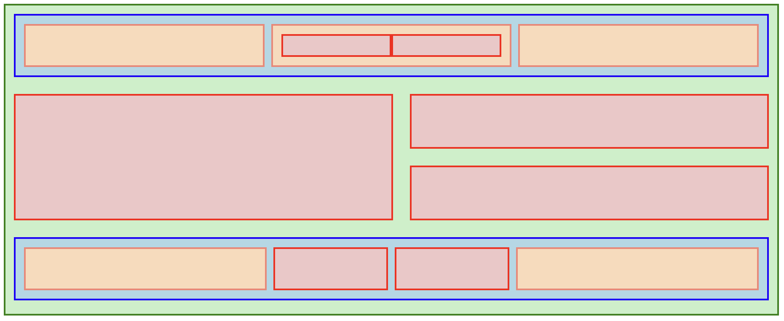

# Flexbox Layout Replication

While learning **Flexbox** using [The Odin Project](https://www.theodinproject.com/), I came across a wild and interesting layout in the very first section.

I decided to pause my progress and try replicating it from scratch — purely using **HTML and CSS Flexbox**.

Here’s the result 👇

---

## 📁 Tech Stack

-   HTML5
-   CSS3 (Flexbox)
